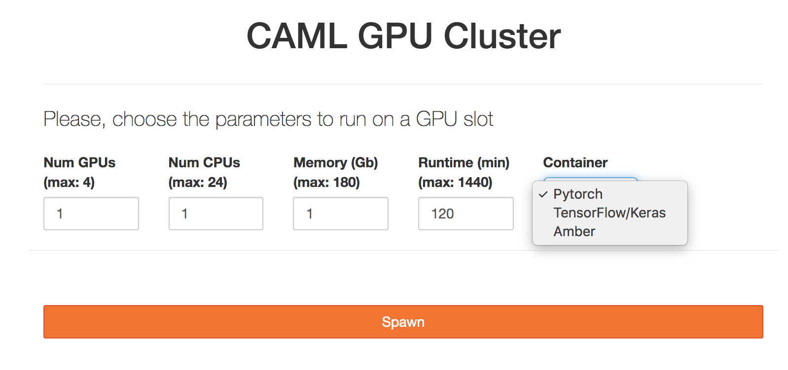
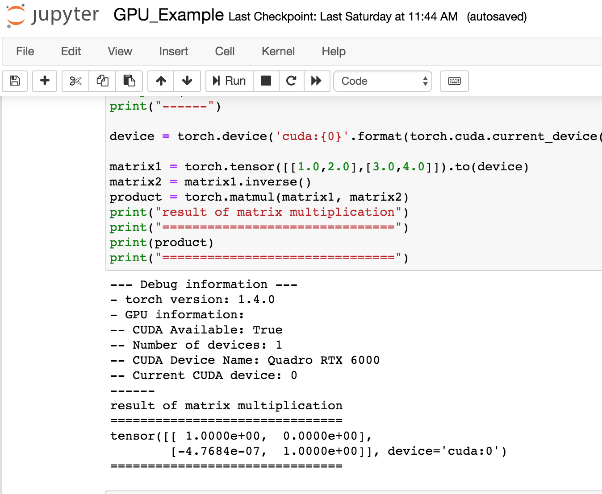

# CAML-ND GPU Tests

## Condor Submission

In order to use CAML resources, we require defining singularity images on PATHs. E.g.: Via cvmfs.

The following Notre Dame image (available via CVMFS) supports TensorFlow, Keras and PyTorch:

```
/cvmfs/singularity.opensciencegrid.org/notredamedulac/el7-tensorflow-pytorch:latest
```
is built from: https://github.com/NDCMS/el7-tensorflow-gpu

## Setting up this tutorial examples

Once you log in into camlnd.crc.nd.edu, type: 

```
cd /scratch365/$USER
git clone https://github.com/khurtado/ndgputests
cd ndgputests
```
Then, follow one or both of the examples below.

### Tensorflow example

```
$ condor_submit submit_tensorflow.jdl
```
Output example:
```
  - Executing python TensorFlow matrix multiplication example
  2020-03-25 13:18:29.845113: I tensorflow/core/platform/cpu_feature_guard.cc:141] Your CPU supports instructions that this TensorFlow binary was not compil    ed to use: AVX2 AVX512F FMA
  2020-03-25 13:18:30.004982: I tensorflow/core/common_runtime/gpu/gpu_device.cc:1432] Found device 0 with properties:
  name: Quadro RTX 6000 major: 7 minor: 5 memoryClockRate(GHz): 1.62
  pciBusID: 0000:2f:00.0
  totalMemory: 22.17GiB freeMemory: 22.00GiB
  2020-03-25 13:18:30.005161: I tensorflow/core/common_runtime/gpu/gpu_device.cc:1511] Adding visible gpu devices: 0
  2020-03-25 13:18:30.570670: I tensorflow/core/common_runtime/gpu/gpu_device.cc:982] Device interconnect StreamExecutor with strength 1 edge matrix:
  2020-03-25 13:18:30.570757: I tensorflow/core/common_runtime/gpu/gpu_device.cc:988]      0
  2020-03-25 13:18:30.570794: I tensorflow/core/common_runtime/gpu/gpu_device.cc:1001] 0:   N
  2020-03-25 13:18:30.570954: I tensorflow/core/common_runtime/gpu/gpu_device.cc:1115] Created TensorFlow device (/job:localhost/replica:0/task:0/device:GPU    :0 with 21320 MB memory) -> physical GPU (device: 0, name: Quadro RTX 6000, pci bus id: 0000:2f:00.0, compute capability: 7.5)
  result of matrix multiplication
  ===============================
  [[ 1.0000000e+00  0.0000000e+00]
   [-4.7683716e-07  1.0000002e+00]]
  ===============================
 ```

### Pytorch example

```
$ condor_submit submit_pytorch.jdl
```
Output example:
```
  - Executing python torch matrix multiplication example
  --- Debug information ---
  - torch version: 1.4.0
  - GPU information:
  -- CUDA Available: True
  -- Number of devices: 1
  -- CUDA Device Name: Quadro RTX 6000
  -- Current CUDA device: 0
  ------
  result of matrix multiplication
  ===============================
  tensor([[ 1.0000e+00,  0.0000e+00],
          [-4.7684e-07,  1.0000e+00]], device='cuda:0')
 ```

## Amber example:

```
$ condor_submit submit_amber.jdl
```
Output example:
```
- Entering scratch365 submit directory
- Executing pmemd.cuda
- Amber job is completed.
- Exit code: 0

# From mdout
|------------------- GPU DEVICE INFO --------------------
|
|            CUDA_VISIBLE_DEVICES: 0
|   CUDA Capable Devices Detected:      1
|           CUDA Device ID in use:      0
|                CUDA Device Name: Quadro RTX 6000
|     CUDA Device Global Mem Size:  22698 MB
| CUDA Device Num Multiprocessors:     72
|           CUDA Device Core Freq:   1.62 GHz
|
|--------------------------------------------------------
```

## Jupyterhub service
(This is still experimental and has no technical support)

### Pre-requisites
Users need to run the university VPN in order to access this service. Please, refer to OIT documentation for more information regarding using the campus VPN: https://oit.nd.edu/services/network/  

### Instructions
After you get an account in camlnd.crc.nd.edu, you can click on the URL below in order to user Jupyterhub with CAML resources.
This will start jupyter notebooks inside the GPU nodes for a specific amount of time. At present, access to your AFS Home area is allowed in read-only mode, use /scratch365/$USER to write files.

https://camlnd.crc.nd.edu:9800/

1. Use your campus credentials to log in.

<p align="center"></p>

2. Then, set the following parameters (note more demanding parameters may take longer to be scheduled, so please try to estimate the resources and time needed for your work as best as possible):

- GPUs: Number of GPUs for your application, up to 4. Default: 1
- CPUs: Number of CPUs. Default: 1
- Memory: Requested Memory (GB) 
- Runtime: Maximum wall clock time (in minutes) allowed for your notebook to run. Max: 24 hours, Default:2 hours. 
- Container: This will be the software environment needed for your application. Please, ask the CRC for help if you need an environment not listed here.

<p align="center"></p>

3. Finally, you can either run python notebooks or work directly in the terminal. You can try the [pytorch notebook example](jupyter_notebooks/Pytorch.ipynb) with the pytorch container. Note your starting directory will be located on /scratch365/$USER.

<p align="center"></p>


Please, refer to the [jupyter-notebook documentation](https://jupyter-notebook.readthedocs.io/en/stable/examples/Notebook/Notebook%20Basics.html) for more information.

Curated containers: Pytorch
In development: Tensorflow/Keras, Amber
